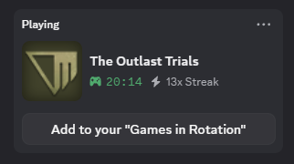
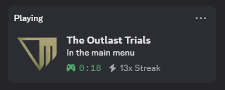
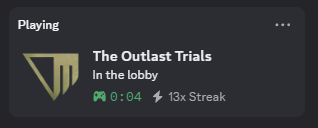
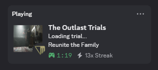
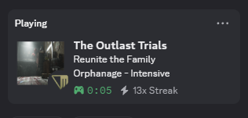
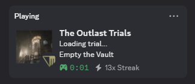
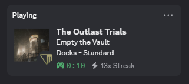

# Better Outlast Presence

Adds Discord Rich Presence for **The Outlast Trials**.

## Purpose

This tool adds in-depth game presence for The Outlast Trials on Discord. This means you can display information about your current game session to other users.


Without the tool, this is always shown:



With the tool:













## Implementation

Because the game developers didn't add Discord rich presence themselves, there is no official API or way to obtain your game session information. So, I decided to look into the Unreal Engine log file that the game constantly outputs to. It has information keywords like, "LoadMap: /Game/Maps/Global/MainMenu" which means the user is in the main menu screen. The tool checks every new line that is added to the log file for these game phases and will update the Discord presence accordingly.

## How to use

pypresence is needed.

```pip install pypresence```

Run main.py and it will detect when your game is open. Main.py needs to be running in the background for the script to work.